# **Negotiator Project – MS2**

# **Pre-development**

**Functional specifications - Given by Code Institute**

- LO1: Design, develop and implement a dynamic front-end web application using HTML, CSS and Javascript.
- LO2: Implement front-end interactivity, including user forms, using core JavaScript, JavaScript libraries and/or Application Programming Interfaces (APIs)
- LO3: Implement front-end interactivity, including user forms, using core JavaScript, JavaScript libraries and/or Application Programming Interfaces (APIs)
- LO4: Deploy an interactive front-end web application to a Cloud platform
- LO5: Demonstrate and document the development process through version control system such as GitHub

**What this means**

- Think like a user and produce a website that is easy to navigate and understand.
- Keep the backdrop from being distracting.
- Ensure the website is standard in terms of style.
- Ensure that there is accessibility even for those people who use assistive technology
- Make sure the website responds to different devices. No point in a website that breaks when viewed on mobile.
- Dynamic website that changes to user input through JavaScript
- Javascript must include if/for/switch loops.
- Code to be dealt with smartly.
- Styled using CSS (passing quality check)
- No Lorem ipsum text.
- Ensure this is fully documented and commented to be clear to any developer reading through.
- Test the code consistently to make sure it does not cause errors to be thrown

**User stories**

**First Time Users**

- As a user who has never played the game, I will want instructions to explain exactly how the game works.
- As a user, I want the page to be clear and easy to understand as to how I can interact with the game
- As a user, I want the phase of the game to be very clear.
- As a user I do not want buttons available that do nothing.
- At the end, I want a results screen that shows me how I did in the game

**Hitting these targets**

- As a user who has never played the game, I will want instructions to explain exactly how the game works.

  - There is a set of instructions within modals clearly visible at the bottom of the page. This will provide the user with the information required to play the game.

- As a user, I want the page to be clear and easy to understand as to how I can interact with the game

  - All buttons that are used in games are highlighted in different colours and are very obvious.

- As a user, I want the phase of the game to be very clear.

  - The phase of the game is highlighted in green and named so that the player knows exactly what to do.

- As a user I do not want buttons available that do nothing.

  - Where possible buttons that are not required are hidden and then unhidden when needed.

- At the end, I want a results screen that shows me how I did in the game

  - The results page makes it very obvious whether the user has won or lost. It also provides a breakdown of how many survivors they managed to save and a bit of fluff text.

**Returning User**

- As a returning user, I would prefer not to have to keep logging in.
- As a returning user, I would like to replay the game once it has finished

**Hitting these targets**

- As a returning user, I would prefer not to have to keep logging in.

  - Using PHP, I have used a session variable to ensure that login is required once per session. You can log out, if wanted, but the browser will purge session data once closed.

- As a returning user, I would like to replay the game once it has finished

  - At the end of the game there is a retry button that enacts a reload() call. This will refresh the screen and restart the game.

**Entity relationship**

**Preliminary Designs**

These can be found [Pdf of wireframes](negotiationwireframes.pdf "here")

**Features**

- Responsive on all device sizes
- Interactive
- JavaScript and PHP integration

# **Post-Development**

To access the page go to your favourite browser and type &quot;[http://ms2.r-guest-developer.world](http://ms2.r-guest-developer.world/)&quot; or &quot;[https://r-guest-developer.world/ms2/](https://r-guest-developer.world/ms2/)&quot; into the search bar. The code is hosted at &quot;[https://github.com/rguest20/MS2](https://github.com/rguest20/MS2)&quot;.

**Dependencies**

**HTML**

I am using HTML 5 and this is shown by the use of the &#39;html&#39; tag used at the start of the document. This comes with all of the semantic markup that I need to ensure that the code is easy to read and debug if necessary.

**PHP**

PHP is naturally supported by the webhost that I am using and acts a server side language to deal with the form that is inputted. This then allows me to verify whether or not a person is authorised to view the game

**JavaScript**

There are several JavaScript libraries that are required to ensure the page works, but these are included in the hosted site, so no dependencies are needed for viewing the site. For the sake of clarity, these are the JavaScript libraries that are used:

- JQuery
- Chart.js
- require.js
- fireworks.js

I have also included several JavaScript libraries that I have written that makes the game function.

**CSS**

Again, several CSS dependencies are used but are included with the site, so do not need anything installing to use. Again, for the sake of clarity these dependencies are listed below:

- Bootstrap 4
- TailwindCSS
- Google Fonts
- Normalise CSS

CSS for the pages is included in a separate stylesheet, but this is again hosted and built bespoke to extend the dependencies.

**How to use**

**Authorisation Page**

This page is very simplistic and minimalistic as it simply acts as a gatekeeper to the actual game. The password is currently made very obvious, but later will be hidden to keep the page secure.

**Negotiation page**
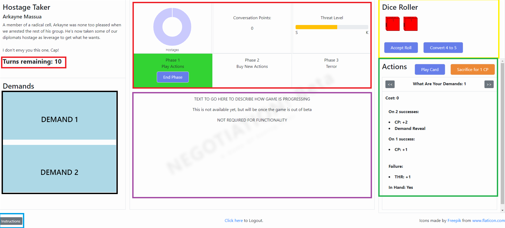

Green: The user input area. Scrolling left and right using the arrows will skip through the different actions available to the user. Play card and sacrifice are made obvious ( as is buy when in the correct phase. There is another hidden button that allows the player to get extra cards for free, but the correct demand must be used to do so. The other information on here is the cost, if available and the outcomes for each card, based on the dice roll.

Red: User information. From left to right this is the turn counter, the hostages remaining (in graph form). The number of conversation points accrued currently and the threat level. Below that is the phases of the game with the current phase highlighted.

Yellow: The dice roller built with 3d CSS. This gives a visual representation of what the user may have rolled if s/he used real dice

Purple: This space was designed to have extra fluff text added, however, it is not required for the functionality of the game.

Black: Demand cards. These will flip when a successful &quot;what are your demands&quot; card is played.

Blue: Instructions button. Brings up a series of modals to explain how the game is played.

Upon completion, the game will automatically bring up the end game screen to let you know how you did.

**UX design**

To make the design more user friendly I have done the following:

- I have used a stark colour palette in order to keep the website visually appealing
- Information on the game is split into various sections to make it obvious what is what.
- Demand cards start flipped and will only flip if invoked in game
- Buttons are coloured and very obvious.
- Instructions are available at the bottom where the user may expect to see extra information.
- Buttons will fade slightly to show they are clickable

# **Testing**

**W3C Validator**

- Index.php
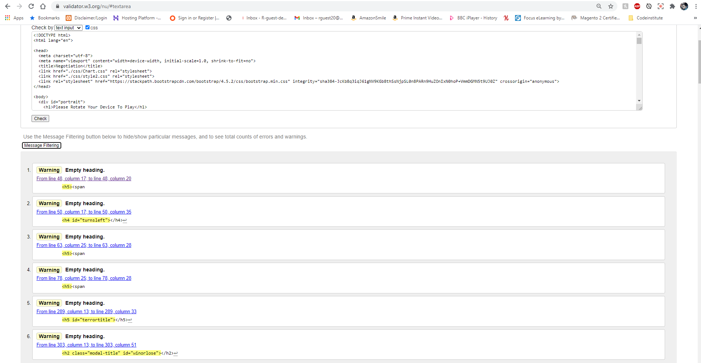
The errors shown here are not true errors as the empty headings are filled by JavaScript during the game

- Login.php
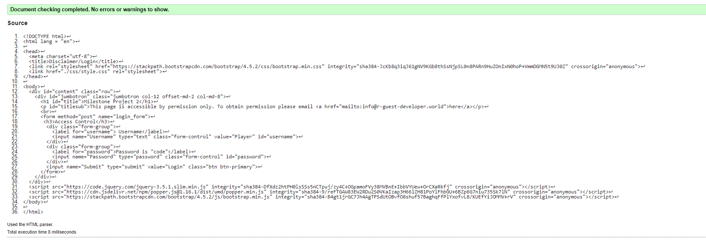
No errors detected
**JS Linter**

- conversationcards.js
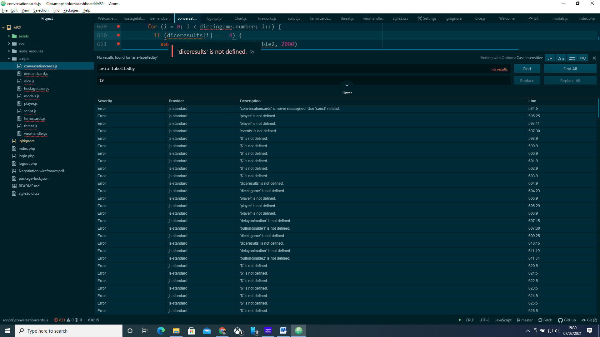
- demandcards.js
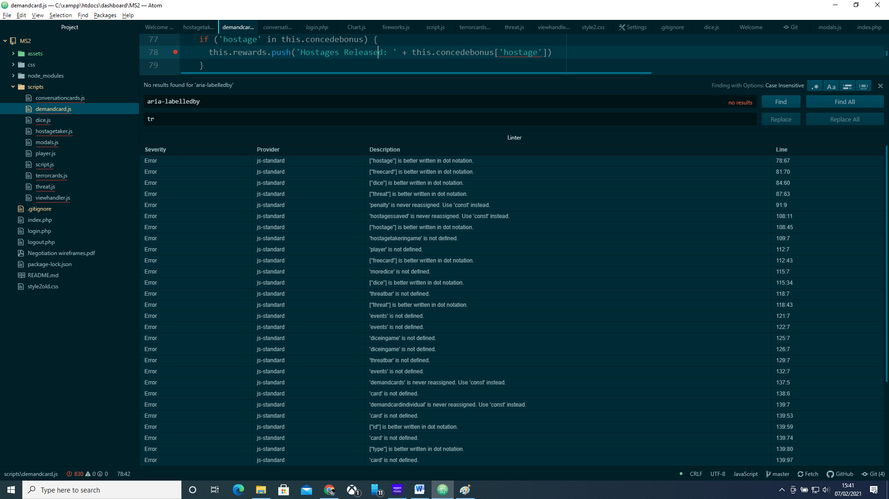
- dice.js
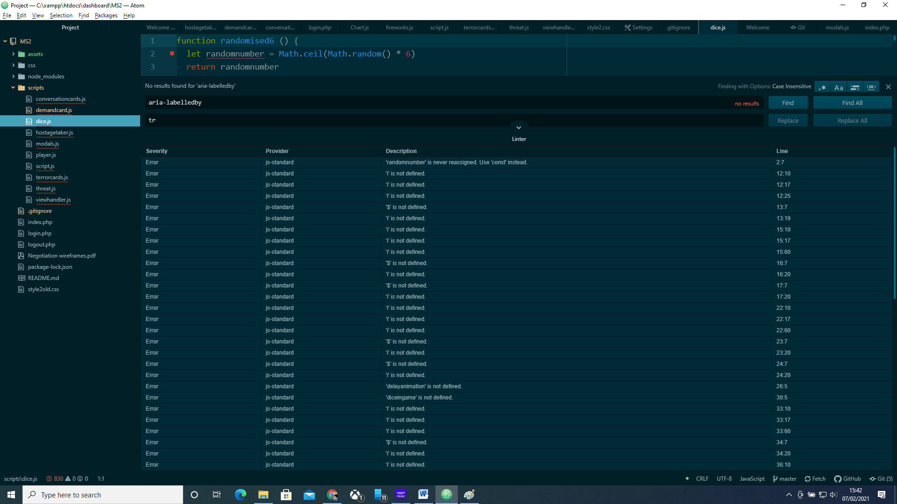
- hostagetaker.js
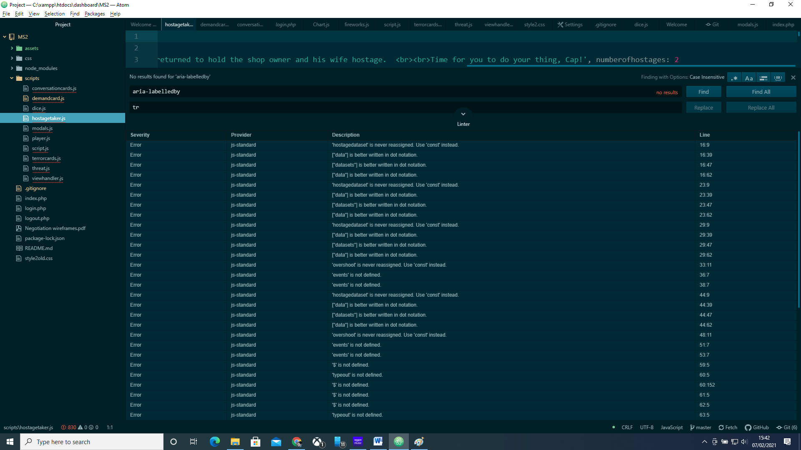
- modals.js
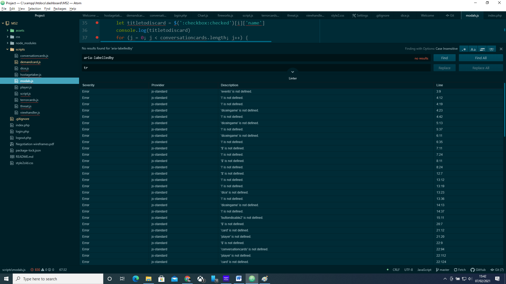
- player.js
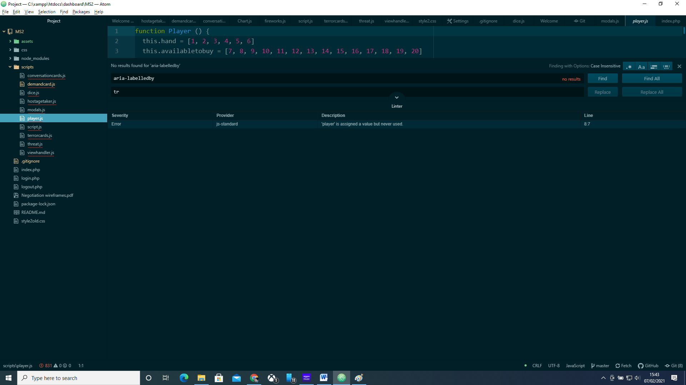
- script.js
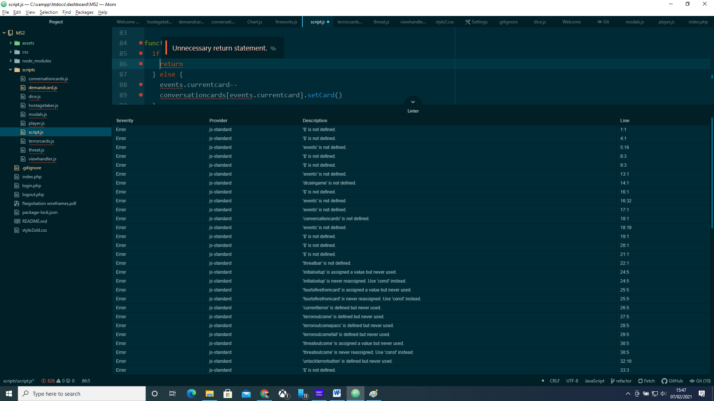
- terrorcards.js
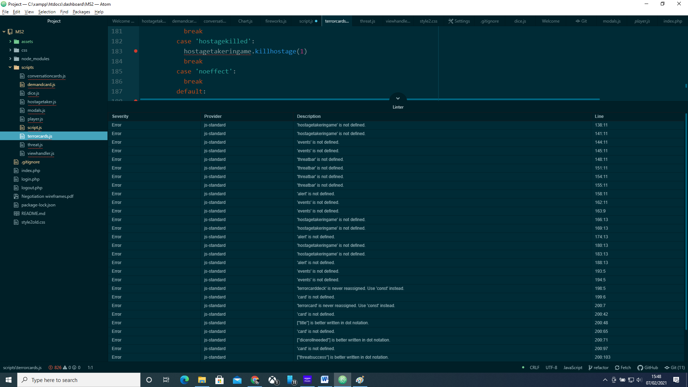
- threat.js
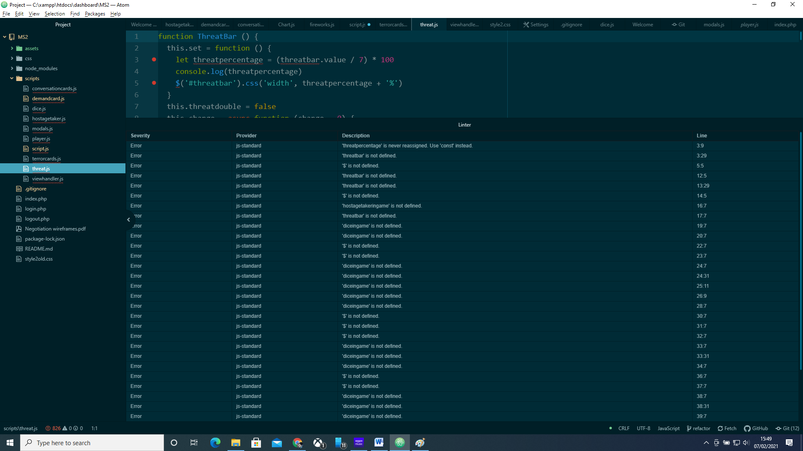
- viewhandler.js

The errors here are of one of two types:
- Error shown as the object is either not defined or not used.
This is not a true error as other js files will use the variables and objects created
- Error shown as dot notation would be better
This is a warning rather than an error and works absolutely fine.

**Further Testing**

- The Website was tested on Google Chrome, Internet Explorer, Microsoft Edge and Safari browsers.
- The website was viewed on a variety of devices such as Desktop, Laptop, iPhone7, iPhone 8 &amp; iPhoneX.
- Friends and family members were asked to review the site and documentation to point out any bugs and/or user experience issues.
- Extensive manual testing was done to ensure that all functions for each object acted as expected. Much of this was done in the console, calling functions and objects and inspecting them to ensure that all was acting as expected. An example of this process is given below:

1. Terror cards should have been shuffled, but unless I play through multiple times, it is hard to tell this had happened. So I call the console and inspect the &#39;terrorcarddeck&#39; element

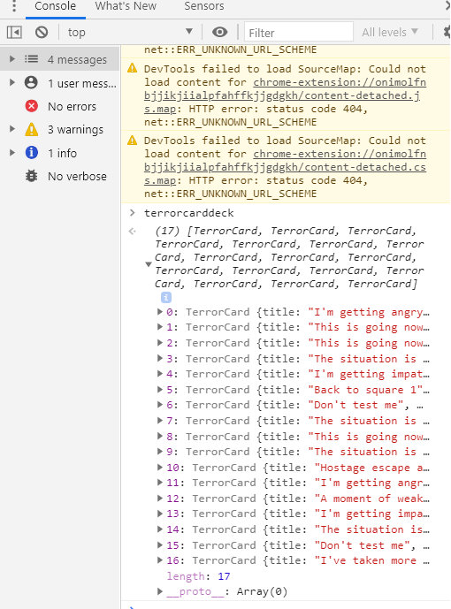

2. Once here I can call the shuffle() function on them (this returns undefined as there is no &#39;return&#39; statement to the function.

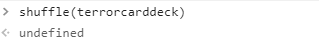

3. This then rearranges the cards meaning the shuffle was successful.

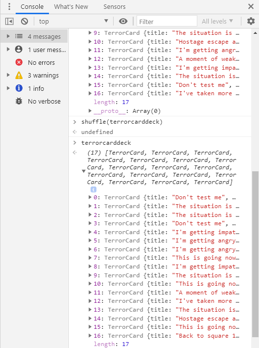

**Deployment**

**Do Not Deploy To GitHub Pages – PHP does not work on GitHub Pages**

**Hostinger Hosted Webpage**

The project was deployed to Hostinger using the following steps...

1. Log in to Hostinger and enter the host settings
2. Travel to the git settings and create a new link between GitHub and the page
3. locate the [GitHub Repository](https://github.com/)and copy the address of that page into the bar asking for origin
4. Under the page asking for location type &#39;ms2/&#39;. This will create a folder to place the GitHub content into.
5. Press deploy and wait.
6. Optionally create a subsite within the website linked to &#39;\&lt;root\&gt;/ms2/&#39;
7. You can then view the site through &#39;\&lt;root\&gt;/ms2/&#39;

**Forking the GitHub Repository**

By forking the GitHub Repository we make a copy of the original repository on our GitHub account to view and/or make changes without affecting the original repository by using the following steps...

1. Log in to GitHub and locate the [GitHub Repository](https://github.com/)
2. At the top of the Repository (not top of page) just above the &quot;Settings&quot; Button on the menu, locate the &quot;Fork&quot; Button.
3. You should now have a copy of the original repository in your GitHub account.

**Making a Local Clone**

1. Log in to GitHub and locate the [GitHub Repository](https://github.com/)
2. Under the repository name, click &quot;Clone or download&quot;.
3. To clone the repository using HTTPS, under &quot;Clone with HTTPS&quot;, copy the link.
4. Open Git Bash
5. Change the current working directory to the location where you want the cloned directory to be made.
6. Type git clone, and then paste the URL you copied in Step 3.

$ git clone https://github.com/rguest20/ms2

1. Press Enter. Your local clone will be created.

$ git clone https://github.com/YOUR-USERNAME/YOUR-REPOSITORY

\> Cloning into `CI-Clone`...

\> remote: Counting objects: 10, done.

\> remote: Compressing objects: 100% (8/8), done.

\> remove: Total 10 (delta 1), reused 10 (delta 1)

\> Unpacking objects: 100% (10/10), done.

**Credits**

**Code**

- [Bootstrap4](https://getbootstrap.com/docs/4.4/getting-started/introduction/): Bootstrap Library used throughout the project mainly to make site responsive using the Bootstrap Grid System.
- Tailwind CSS: Library used throughout the project mainly to make site responsive using tailwind classes.
- Normalise CSS: Library to convert CSS to make it work across all devices

**Content**

- All content was written by the developer, except for icons taken from Freepik by flaticon.com

**Media**

- There are media files available in the assets folder that are freely available from google image search (with the option to only show images that are correctly licenced)

**Known issues/extensions to be added**

- Tutorial incomplete - skipped currently
- Text at the bottom of page does not update to create a story-like atmosphere
- Currently only one abductor is available. More to be added later
